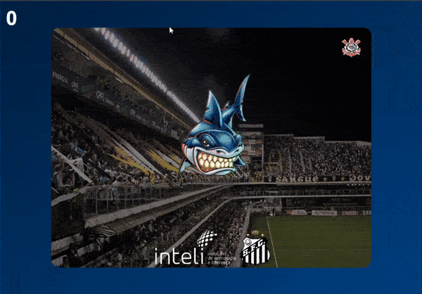

<h1 align="center">
    
Fish exercise

</h1>

## 📖 About

First contact with Phaser exercised in this activity. I decided to go a bit beyond the proposed to get to know this framework better. In this playful and humorous exercise, the mouse cursor controls Santos' mascot, a shark, and you must use it to eat up the other teams that will randomly appear on the game screen. In the top left corner, there's a counter informing how many teams have been 'devoured' by Santos. Available on the GitHub Pages of this repository.

---

## 💻 Technologies

* HTML5;
* CSS3;
* Javascript;
* Phaser.

---

## 🌐 Demonstration

    

